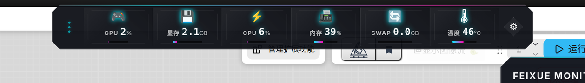

# ComfyUI-Feixue-UniversalMonitor

<p align="center">
  <strong>飞雪监测器</strong> — 专注 AMD · 跨平台 · 5 色 × 5 风格 · 实时硬件监测器
</p>

<p align="center">
  
  
  
  
  
</p>

<p align="center">
  <a href="https://feixue-ai.github.io/ComfyUI-Feixue-UniversalMonitor/?demo">🖥️ 在线预览外观 (Live Demo)</a>
</p>

---

## 外观预览



> 上图展示了 Premium UI 流光玻璃（Ind）风格监控栏，采用黑曜石棱镜 HUD 设计，包含 GPU / VRAM / CPU / RAM / SWAP / TEMP 六项实时指标。
>
> 插件支持 **5 种颜色方案 × 5 种视觉风格**，共 **25 种组合**，可在设置面板中一键切换。
>
> 在线演示（早期设计原型，非当前 ComfyUI 内真实 UI）：[Live Demo](https://feixue-ai.github.io/ComfyUI-Feixue-UniversalMonitor/?demo)

### 5 种视觉风格

| 风格 | 英文名 | 设计特点 |
|------|--------|----------|
| **拟物白** | Neu | 白色新拟态（Neumorphism），医疗仪表式内凹窗口，精确凹槽底座，柔和浮雕阴影 |
| **流光玻璃** | Ind | 黑曜石棱镜 HUD，八边形晶体切割边缘，霓虹能量线，深色高可读性面板 |
| **复古终端** | Retro | CRT 荧光屏效果，LED 段码条，扫描线与辉光，支持 5 种磷光色 |
| **珠宝柜** | Lux | 黑金奢侈品展柜，金色镶边与宝石色调，高对比度数据卡片 |
| **量子核** | Cyber | 重型钛金机架 + 霓虹灯管，HUD 数字，未来科幻感 |

### 5 种颜色方案

极光陶瓷 / 深海蓝 / 落日暖 / 森林绿 / 午夜黑（不同风格会映射为对应材质色或磷光色）。

---

## 特性

- **实时硬件监测** — GPU 利用率、显存（VRAM，以 GB 显示）、CPU 负载、物理内存（RAM）、虚拟内存（Swap）、GPU 温度、磁盘 I/O、网络速率，共 8 项指标
- **5 色 × 5 风格独立组合** — 颜色与视觉风格完全解耦，25 种搭配一键切换
- **中/英文自动适配** — 根据浏览器语言自动显示中文或英文标签，避免翻译软件与布局溢出
- **工作流声音提示** — ComfyUI 工作流完成或出错时播放提示音，开关状态跨主题持久同步
- **拖拽自由定位** — 开启拖拽模式后可自由移动监测栏，关闭后自动回到顶部居中；主题切换后自动归位
- **折叠式悬浮面板** — 点击齿轮打开设置面板，支持分区展开/收起
- **Neu 医疗仪表窗口** — 监测条采用精确镶嵌的内凹仪表窗口 + 连续凹槽底座，质感更高级
- **Ind 黑曜石棱镜 HUD** — 八边形晶体切割 Dock / Panel，霓虹能量线，与 Neu 形成强烈视觉反差
- **跨平台 AMD 优化** — Windows（pynvml / WMI）与 Linux（amdsmi / ROCm / sysfs）三级 fallback 降级
- **WebSocket 实时推送** — 低于 100ms 延迟的数据推送，同时提供 HTTP API 降级模式
- **零外部前端依赖** — 单文件 `extension.js` 自包含全部 UI、CSS、事件与数据逻辑

---

## 安装

### 方式一：ComfyUI Manager（推荐）

1. 打开 ComfyUI → **Manager** → **Install Custom Nodes**
2. 搜索：`ComfyUI-Feixue-UniversalMonitor`
3. 点击 **Install** → **重启** ComfyUI

安装脚本会自动检测操作系统并安装对应依赖：
- **Windows**：`pynvml-amd-windows`（ADLX GPU 监控）、`wmi`（系统信息）
- **Linux**：`amdsmi`（AMD GPU 官方监控库）

### 方式二：手动安装

```bash
cd ComfyUI/custom_nodes
git clone https://github.com/feixue-ai/ComfyUI-Feixue-UniversalMonitor.git
```

然后重启 ComfyUI，插件会自动启动后端监控服务。

---

## 使用

安装后，监控栏自动显示在 ComfyUI 界面顶部：

- **6 项核心指标**：GPU 利用率 | 显存（VRAM） | CPU 负载 | 物理内存（RAM） | 虚拟内存（Swap） | GPU 温度
- **2 项辅助指标**：磁盘 I/O | 网络速率（在悬浮面板中查看）
- **主题切换**：点击监测栏右侧的 ⚙️ 齿轮按钮打开设置面板，在「风格」与「色彩」区切换
- **声音提示**：在设置面板中开启/关闭，状态会自动保存并在所有主题间同步
- **拖拽定位**：开启「拖拽模式」后可拖拽监测栏，关闭后自动回到顶部居中
- **实时更新**：默认 2 秒刷新间隔，数据通过 WebSocket 实时推送

---

## 项目结构

```
ComfyUI-Feixue-UniversalMonitor/
├── __init__.py              # 插件入口 & HTTP API 路由
├── pyproject.toml           # 包元数据与 ComfyUI 注册表信息
├── install.py               # 跨平台自动依赖安装
├── requirements.txt         # 基础依赖声明
├── core/
│   ├── monitor.py           # 核心硬件采集引擎 (FeixueHardwareInfo)
│   ├── websocket_service.py # WebSocket 实时推送服务
│   └── data_models.py       # 数据模型定义
├── collectors/              # 数据采集器 (CPU, Memory, Predictor)
├── providers/amd/           # AMD GPU 数据源 (ROCm/sysfs)
├── config/                  # 配置管理
├── utils/                   # 平台检测、线程安全、性能优化
├── web/
│   └── extension.js         # 前端 UI (Premium UI v3.25)
├── docs/
│   └── index.html           # 在线外观演示 (GitHub Pages)
└── tests/                   # 单元测试
```

---

## 技术细节

| 层级 | 技术栈 |
|------|--------|
| **后端数据采集** | Python (psutil, pynvml-amd-windows, amdsmi, WMI, PyTorch) |
| **前端 UI** | Vanilla JavaScript（零外部依赖，单文件自包含） |
| **数据通道** | WebSocket (`feixue.monitor` 事件) + HTTP REST API |
| **兼容性** | ComfyUI (Windows / Linux Ubuntu)，AMD / NVIDIA GPU |

### 数据采集策略

```
GPU 数据源优先级:
  Windows: pynvml (ADLX) → PyTorch → PowerShell → WMI
  Linux:   amdsmi → rocm_smi → sysfs

CPU/RAM/Swap: psutil (跨平台统一)
```

所有采集操作均有超时保护（≤8s），异常时自动降级到缓存数据或安全默认值，确保 ComfyUI 主流程不受影响。

---

## 更新日志

### v3.25 — Premium UI 5 色 × 5 风格重构 + 国际化 + 声音同步（当前版本）

- **全新 5 种视觉风格**：拟物白（Neu）、流光玻璃（Ind）、复古终端（Retro）、珠宝柜（Lux）、量子核（Cyber）
- **5 种颜色方案独立切换**：极光陶瓷 / 深海蓝 / 落日暖 / 森林绿 / 午夜黑
- **中/英文自动适配**：根据系统语言显示中文或英文，关键标签保持简短避免 UI 溢出
- **显存统一显示为 GB**：所有风格坞站与面板中 VRAM 均显示为已用/总容量（GB）
- **声音提示状态持久同步**：修复主题切换后提示音开关状态不一致的问题，支持跨主题记忆
- **主题切换自动归位**：切换风格后监测条自动回到顶部居中，避免旧位置残留
- **Lux 温度显示修复**：补全珠宝柜风格的 GPU 温度渲染
- **Cyber 折叠面板修复**：修复量子核风格设置面板展开/收起失效的问题
- **Neu 医疗仪表窗口重做**：芯片改为精确镶嵌的内凹仪表窗口，底座凹槽对齐，整体质感向高端医疗设备看齐
- **Ind 黑曜石棱镜 HUD 重做**：八边形晶体切割 Dock / Panel，顶部霓虹能量线，与 Neu 形成强烈视觉反差
- **Retro 暗色 LED 条修复**：恢复未激活时的暗色背景条，保持监测条视觉饱满
- **版本号统一**：代码、面板、包元数据全部统一为 v3.25
- **清理遗留代码**：移除旧版 Emerald Capsule / v13 主题系统的死代码与 DEBUG 日志

### v3.1.0 — 黑曜石玻璃重构 + 5 风格完全隔离

- 悬浮面板全面重构：半透明毛玻璃 + 多层弥散阴影 + 玻璃边缘高光
- 5 种风格完全视觉隔离
- 新增磁盘 I/O 和网络速率监测
- 跨平台所有指标可用

### v3.0.1 — Emerald Capsule

- 完整 UI 重写：药丸/胶囊形设计 + 3D 圆柱横截面立体效果
- 新增 5 色主题系统
- 新增拖拽自由定位功能
- 新增 Swap 虚拟内存监测

### v2.5.0

- 首次公开发布
- 基础监测功能 (GPU/CPU/RAM)
- WebSocket 实时推送

---

## 许可证

MIT License

---

## 作者

[Feixue Team](https://github.com/feixue-ai)
